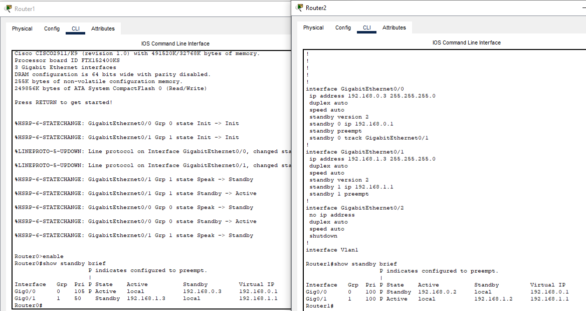

# Домашнее задание к занятию 1 «Disaster recovery и Keepalived»- Протопопов Николай Андреевич


### Инструкция по выполнению домашнего задания

   1. Сделайте `fork` данного репозитория к себе в Github и переименуйте его по названию или номеру занятия, например, https://github.com/имя-вашего-репозитория/git-hw или  https://github.com/имя-вашего-репозитория/7-1-ansible-hw).
   2. Выполните клонирование данного репозитория к себе на ПК с помощью команды `git clone`.
   3. Выполните домашнее задание и заполните у себя локально этот файл README.md:
      - впишите вверху название занятия и вашу фамилию и имя
      - в каждом задании добавьте решение в требуемом виде (текст/код/скриншоты/ссылка)
      - для корректного добавления скриншотов воспользуйтесь [инструкцией "Как вставить скриншот в шаблон с решением](https://github.com/netology-code/sys-pattern-homework/blob/main/screen-instruction.md)
      - при оформлении используйте возможности языка разметки md (коротко об этом можно посмотреть в [инструкции  по MarkDown](https://github.com/netology-code/sys-pattern-homework/blob/main/md-instruction.md))
   4. После завершения работы над домашним заданием сделайте коммит (`git commit -m "comment"`) и отправьте его на Github (`git push origin`);
   5. Для проверки домашнего задания преподавателем в личном кабинете прикрепите и отправьте ссылку на решение в виде md-файла в вашем Github.
   6. Любые вопросы по выполнению заданий спрашивайте в чате учебной группы и/или в разделе “Вопросы по заданию” в личном кабинете.
   
Желаем успехов в выполнении домашнего задания!
   
### Дополнительные материалы, которые могут быть полезны для выполнения задания

1. [Руководство по оформлению Markdown файлов](https://gist.github.com/Jekins/2bf2d0638163f1294637#Code)


---
#Комманды для работы с GIT
1. git clone https://github.com/Nikolay-Protopopov/homework-zabbix.git
2. cd homework-zabbix 
3. mkdir screenshots
4. git add README.md screenshots/ 
5. git commit -m "Добавлены скриншоты и обновлен README"
6. git remote set-url origin "https://мой токен@github.com/Nikolay-Protopopov/homework-zabbix.git"
7. git push origin main

### Задание 1
Дана схема для Cisco Packet Tracer, рассматриваемая в лекции.
На данной схеме уже настроено отслеживание интерфейсов маршрутизаторов Gi0/1 (для нулевой группы)
Необходимо аналогично настроить отслеживание состояния интерфейсов Gi0/0 (для первой группы).
Для проверки корректности настройки, разорвите один из кабелей между одним из маршрутизаторов и Switch0 и запустите ping между PC0 и Server0.
На проверку отправьте получившуюся схему в формате pkt и скриншот, где виден процесс настройки маршрутизатора.

### router 1
```enable
configure terminal

! Настройка интерфейса Gi0/0
interface GigabitEthernet0/0
 ip address 192.168.0.3 255.255.255.0
 standby 0 ip 192.168.0.1
 standby 0 priority 100
 standby 0 preempt
 standby 0 name GROUP_0
 no shutdown

! Настройка интерфейса Gi0/1
interface GigabitEthernet0/1
 ip address 192.168.1.3 255.255.255.0
 standby 1 ip 192.168.1.1
 standby 1 priority 100
 standby 1 preempt
 standby 1 name GROUP_1
 no shutdown

end
write memory
```
### router 0
```
enable
configure terminal

! Настройка интерфейса Gi0/0
interface GigabitEthernet0/0
 ip address 192.168.0.2 255.255.255.0
 standby 0 ip 192.168.0.1
 standby 0 priority 105
 standby 0 preempt
 standby 0 name GROUP_0
 no shutdown

! Настройка интерфейса Gi0/1
interface GigabitEthernet0/1
 ip address 192.168.1.2 255.255.255.0
 standby 1 ip 192.168.1.1
 standby 1 priority 105
 standby 1 preempt
 standby 1 name GROUP_1
 no shutdown

end
write memory
```

### Задание 2
Добавьте в Zabbix два хоста и задайте им имена <фамилия и инициалы-1> и <фамилия и инициалы-2>. Например: ivanovii-1 и ivanovii-2.

### Задание 3
Привяжите созданный шаблон к двум хостам. Также привяжите к обоим хостам шаблон Linux by Zabbix Agent.


### Задание 4
Создайте свой кастомный дашборд.

### Задание 5
Создайте карту и расположите на ней два своих хоста.


### Задание 6
Создайте UserParameter на bash и прикрепите его к созданному вами ранее шаблону. Он должен вызывать скрипт, который:

при получении 1 будет возвращать ваши ФИО,
при получении 2 будет возвращать текущую дату.

### Скрипт для возврата ФИО или текущей даты
### Принимает аргумент: 1 - ФИО, 2 - дата

```bash
case "$1" in
    "1")
        # Возвращаем ФИО 
        echo "Протопопов Николай"
        ;;
    "2")
        # Возвращаем текущую дату
        date '+%Y-%m-%d %H:%M:%S'
        ;;
    *)
        # Если передан неверный аргумент
        echo "Error: Use 1 for FIO or 2 for date"
        exit 1
        ;;
esac
